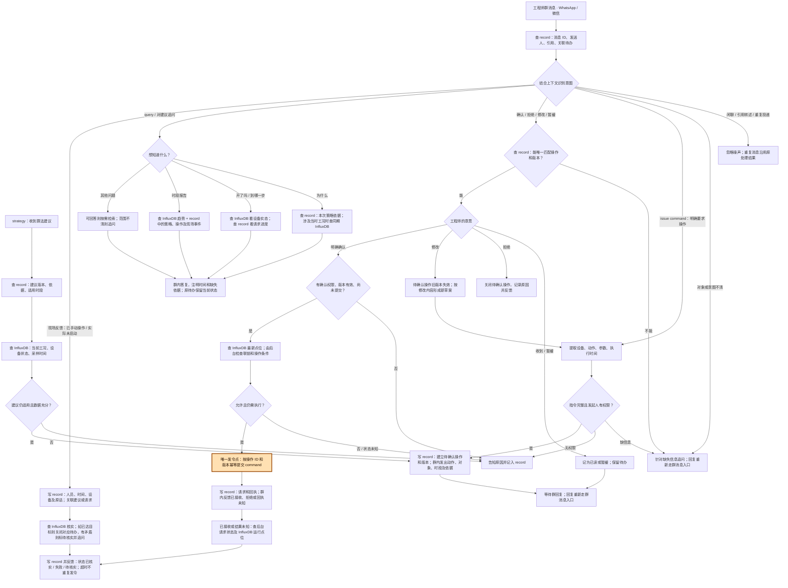

# 冷站 AI 与现场工程师交互流程（设计稿）

```mermaid
flowchart TD
  G["工程师群消息 · WhatsApp / 微信"] --> R["查 record：消息 ID、发送人、引用、关联待办"]
  R --> I{"结合上下文识别意图"}
  I -->|闲聊 / 引用转述 / 重复投递| Z["忽略噪声；重复消息沿用原处理结果"]
  I -->|对象或意图不清| C["针对缺失信息追问；回复重新走群消息入口"]
  I -->|issue command：明确要求操作| D["提取设备、动作、参数、执行时间"]
  D --> V{"指令完整且发起人有权限？"}
  V -->|缺信息| C
  V -->|无权限| N["告知原因并记入 record"]
  V -->|是| P
  S["strategy：收到算法建议"] --> SR["查 record：建议版本、依据、适用时段"]
  SR --> SD["查 InfluxDB：当前工况、设备状态、采样时间"]
  SD --> SV{"建议仍适用且数据充分？"}
  SV -->|否| N
  SV -->|是| P["写 record：建立待确认操作和版本；群内发出动作、对象、时段及依据"]
  P --> W["等待群回复；回复重新走群消息入口"]
  I -->|确认 / 拒绝 / 修改 / 暂缓| A{"查 record：能唯一匹配操作和版本？"}
  A -->|不能| C
  A -->|能| H{"工程师的意思"}
  H -->|收到 / 暂缓| HOLD["记为已读或暂缓；保留待办"] --> W
  H -->|拒绝| REJ["关闭待确认操作，记录原因并反馈"]
  H -->|修改| M["待确认操作旧版本失效；按修改内容形成新草案"] --> D
  H -->|明确确认| K{"有确认权限、版本有效、尚未提交？"}
  K -->|否| N
  K -->|是| F["查 InfluxDB 最新点位；由后台检查联锁和操作条件"]
  F --> B{"允许且仍需执行？"}
  B -->|否 / 状态未知| N
  B -->|是| CMD["唯一发令点：按操作 ID 和版本幂等提交 command"]
  CMD --> ACK["写 record：请求和回执；群内反馈已接收、拒绝或回执未知"]
  ACK --> T["已接收或结果未知：查后台请求状态及 InfluxDB 运行点位"]
  T --> OUT["写 record 并反馈：状态已核实 / 失败 / 待核实；超时不重复发令"]
  I -->|query / 对建议追问| Q{"想知道什么？"}
  Q -->|为什么| WHY["查 record：本次策略依据；涉及当时工况时查同期 InfluxDB"]
  Q -->|开了吗 / 到哪一步| ST["查 InfluxDB 看设备实态；查 record 看请求进度"]
  Q -->|时段报告| REP["查 InfluxDB 趋势 + record 中的策略、操作及现场事件"]
  Q -->|其他问题| OTHER["可回答则按需检索；范围不清则追问"]
  WHY & ST & REP & OTHER --> ANSW["群内答复，注明时间和缺失依据；原待办保留当前状态"]
  I -->|现场反馈：已手动操作 / 实际未启动| FB["写 record：人员、时间、设备及原话；关联建议或请求"]
  FB --> CHECK["查 InfluxDB 核实；如已达目标则关闭对应待办，有矛盾则标待核实并追问"] --> OUT
  classDef command fill:#ffe0b2,stroke:#9a4600,stroke-width:3px,color:#241000
  class CMD command
```

同一条消息可以包含多个意图。“为什么要开？先别动”同时走暂缓和查询。优先处理暂缓、拒绝或修改，再回答问题。操作已经提交之后收到撤销或修改，先查原请求进度；后续设备动作须作为新操作重新确认。
